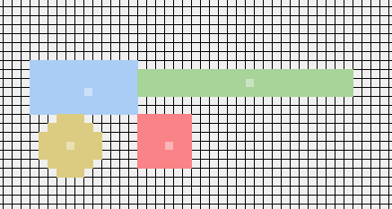
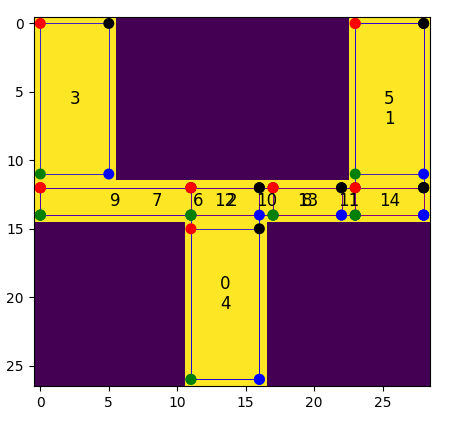

# Utilizing Generative Adversarial Networks for Stable Structure Generation in Angry Birds

Welcome to the repository for the paper [Utilizing Generative Adversarial Networks for Stable Structure Generation in Angry Birds](./AIIDE_Utilizing_GANs_for_Stable_Structure_Generation_in_Angry_Brids.pdf).

Included in this repository are:   
1. The pretrained GAN models to generate Science Birds structures.
2. An application to test various model architectures and the decoding algorithm.
3. The AIIDE 2023 paper and [Master Thesis](./Frederic_Abraham-Master_Thesis-Stable__Structure_Generation_with_GANs-signed.pdf) that describe the generation process.
4. The generated testing dataset on which the presented results are based, along with the original GAN output and data collected through simulation.

### Examples:

| Low Profile | Many Blocks |
|------------|------------------------------------------------|
|  |  |

| Many Pigs | Tower |
|------------|------------------------------------------------|
|  |  |

### Abstract:  
> This paper investigates the suitability of using Generative Adversarial Networks (GANs) to generate stable structures for the physics-based puzzle game Angry Birds. 
> While previous applications of GANs for level generation have been mostly limited to tile-based representations, this paper explores their suitability for creating stable structures made from multiple smaller blocks.   
> This includes a detailed encoding/decoding process for converting between Angry Birds level descriptions and a suitable grid-based representation, as well as utilizing state-of-the-art GAN architectures and training methods to produce new structure designs.  
> Our results show that GANs can be successfully applied to generate a varied range of complex and stable Angry Birds structures. 

## Installation Instructions:

1. Install [Python 3.8](https://www.python.org/downloads/release/python-380/)
1. Navigate into the [src](./src/) folder and create a virtual python environment.
   1. We recommend [pyenv](https://github.com/pyenv/pyenv) with [pyenv-virtualenv](https://github.com/pyenv/pyenv-virtualenv)
   1. Create venv `virtualenv --python C:\Path\To\Python\python.exe venv`
   1. Activate venv `.\venv\Scripts\activate`
1. Install all python modules specified in the requirements.txt file `pip install -r requirements.txt`
1. Download the Windows Science Birds Binaries from [here](https://github.com/Blaxzter/science-birds/releases/tag/v1.0.0) and place them into [science_birds](./src/resources/science_birds/).
   1. Open the StartApplication.py file and modify the science_birds_path parameter for your respective operating system version (Windows is used by default)
   1. You can also export builds for different operating systems from the original Unity source code at [science-birds](https://github.com/Blaxzter/science-birds).
1. If installed correctly, you should be able to start the Testing Application by running the StartApplication.py file `python StartApplication.py`

#### Pretrained models 
To utilise our pretrained models, download them [here](https://drive.google.com/drive/folders/1veidxtf0s1Lwqk-Qj7wzvI2z9Rd3jzRf?usp=drive_link) and place them into [models](./models/).   

#### Generated dataset
To load our generated level dataset to run the evaluation script or view them in the [Dash visualization](https://dash.plotly.com/), download them [here](https://drive.google.com/drive/folders/1ob5ER3G-tJsDz0ypG5nax6Yq6ao4jkSA?usp=drive_link) and put them into [grid_search](./src/resources/data/eval/grid_search/).

### AIIDE 2023 Structure Generation Example
To quickly generate and load structures using the framework presented in our AIIDE 2023 paper [Utilizing Generative Adversarial Networks for Stable Structure Generation in Angry Birds](./AIIDE_Utilizing-Generative-Adversarial-Networks-for-Stable-Structure-Generation-in-Angry-Birds.pdf), follow these steps:
1. Download the "Multilayer With Air" folder from [here](https://drive.google.com/drive/folders/1veidxtf0s1Lwqk-Qj7wzvI2z9Rd3jzRf?usp=drive_link) and place it into [models](./models/).
1. Start the Testing Application by running the StartApplication.py file in the [src](./src/) folder.
1. Open the "Loaded Model" dropdown in the bottom left corner and select the "Multilayer With Air" option.
1. A new image will be automatically generated. New images can be generated by clicking the "New Seed" button, followed by the "Generate Img" button.
1. To decode this image, click the "Decode Gan Img" button in the bottom right corner, and click the "Decode Img" button in the presented popup dialog.
1. To load this decoded level representation in Science Birds, click the "Start Game" button in the top right, then click the "Send To Game" button.
1. If successful, the level will be automatically loaded in the launched Science Birds program.

## Training:

The training script is a work in progress.

```
usage: CreateDatasetAndRunTrainer.py [-h]
                                     [-m {WGANGP128128,WGANGP128128_Multilayer,SimpleGAN88212,SimpleGAN100112,SimpleGAN100116}]
                                     [-d DATASET] [-e EPOCH] [-b BATCH_SIZE]
                                     [-x MULTI_LAYER_SIZE] [-a] [-r RUN_NAME]
                                     [-s SAVE_LOCATION]
                                     [-ds DATASET_SAVE_LOCATION]

GAN Training Script

optional arguments:
  -h, --help            show this help message and exit
  -m {WGANGP128128,WGANGP128128_Multilayer,SimpleGAN88212,SimpleGAN100112,SimpleGAN100116}, --model {WGANGP128128,WGANGP128128_Multilayer,SimpleGAN88212,SimpleGAN100112,SimpleGAN100116}
                        Name of the GAN model to use.
  -d DATASET, --dataset DATASET
                        Path to the dataset folder.
  -e EPOCH, --epoch EPOCH
                        Number of epochs for training.
  -b BATCH_SIZE, --batch_size BATCH_SIZE
                        Batch size for training.
  -x MULTI_LAYER_SIZE, --multi_layer_size MULTI_LAYER_SIZE
                        If a multilayer model is selected the amount of output
                        layers on the last level. 4 = No Air, 5 = With air
  -a, --augmentation    Use data augmentation if set.
  -r RUN_NAME, --run_name RUN_NAME
                        Description/name of the run.
  -s SAVE_LOCATION, --save_location SAVE_LOCATION
                        Location where the model will be saved.
  -ds DATASET_SAVE_LOCATION, --dataset_save_location DATASET_SAVE_LOCATION
                        Location where the created dataset will be saved.

```

## Test Application:

This application has been mainly used to test the various facets of the original thesis.


You can:
1. Load models
1. Test the decoding functions
1. Draw a structure
1. Load decoded structure or loaded structure into science birds

### Tutorial / feature overview

Short description of the functionalities.

#### Drawing 

- The drawing pane (green rectangle) on the left side can be drawn on with the mouse.
- The buttons to the left change what block should be placed.
- You can change what material is placed use the keyboard numbers 1-4.


| Input Drawing | Output_drawing |
|------------|------------------------------------------------|
|  |  |

#### Control Elements (Advanced)

- **Decode Drawing**: That are two alternative processes for decoding an image, chosen using the "Decoding Mode" dropdown in the top right corner.
	- The :LevelImg: option uses the Recursive Rectangle Decoding (RRD) algorithm from section 3.2.1 of the provided Master Thesis. The main concept is that it tries to detect and place rectangles in the drawn image that match the existing block patterns. This approach always fills the presented structure outline if possible, but becomes slow if the structure outline  is too large or impossible to fit.
	- The "One Element" option uses the One-Element Encoding/Decoding representation from section 3.1.3 of the provided Master Thesis. Each block is represented by a single pixel in its center, as seen in the image below. The "recalibrate blocks" check box in the "Decode Gan Image" popup is for moving any blocks overlapping blocks out of one another. The GAN Models using this encoding were sadly too noisy to produce good results.

	

- **Visualize Rectangles**: Used for debugging the RRD decoding approach. It works together with the "Material Rectangle" number. 1 = green (ice), 2 = blue (wood), 3 = red (stone), 4 = yellow (pig).

   Rectangles: 
	 
   Decoded: 
   	  

- **Visualize Block Selection**: The RDD rectangle selection uses a depth first search approach for fitting rectangles. This button visualizes the process like this: 
  [Selection Tree](images/application/SelectionProcess.png)
  The decoded structure is in Figure A.5 of the thesis.

- **Load level**: Takes the index from the **load level ID:** field and loads the level from the provided level folder path into both the drawing area and the decoded level area. 
- **Delete**: Clears the drawing area.

#### Game Interaction

The blue rectangle region is only visible when the folder provided by the science_birds_path exists. You can start the game and send a decoded or loaded level to the game and see how it performs. The screenshot buttons will reload the level, creates a photo of the structure, and adds it as a tab to the right side.

  


#### GAN Interaction

The bottom of the application is for loading a GAN model and generating/saving level images.

- In order to load a model, select one from the dropdown in the bottom left corner. 
- The generate image button takes the current seed and creates a GAN output. This GAN output is visualized in the drawing area as a rounded flattened representation and visualized on the right side (visual representations may differ depending on the selected model).
- When a model uses a threshold to decide whether a pixel is either on or off, the threshold comes from the "Multilayer Threshold" text field. 
- The "New Seed" button creates a new seed to produce a different image.

##### Model overview

GAN structure 1 use the simpler layout described in section 4.2.0.1, and is trained on the Convolutional GANs of section 4.2.0.2.  
The first 4 models also produce only one output layer with values from 0-5 determining the material, whereas the later models use five seperate layers for each material.

| Gan <br> structure | Model Name | Description |
|:------------:|------------|-------------|
| 1 | **Standard GAN 1** | First approach in training a GAN. <br> Standard Training method<br>Mode collapsed <br> Resolution: 100x112 |
| 1 | **Standard GAN 2** | Same as before but with filtered dataset. <br> Resolution 100x116 |
| 1 | **W-GAN SGD** | Using W-GAN-GP training method and same dataset. <br> Quite unclear structure definitions <br> Resolution: 100x116 |
| 1 | **W-GAN ADAM** | Same as before but uses ADAM optimizer. <br> Same results <br> Resolution: 100x116 |
| 2 | **Big Gan Multilayer** | Each Material gets its own layer <br> Same training settings as before but with the bigger model and more epochs. <br> First somewhat defined structures. <br> Resolution: 128x128 |
| 2 | **Multilayer With Air (AIIDE-2023)** | Same as before but uses an extra air layer <br> Better results with less uncertainty <br> doesn't require threshold <br> Resolution: 128x128 |
| 2 | **Multilayer With Air - ReLU** | Same as before with ReLU as last activation layer <br> More noisy results <br> Resolution: 128x128  |
| 2 | **One Element Encoding** | Each block is represented by one block. <br> Values between 1-40 on one layer for each block, material combination. <br> Super noisy even with low threshold.  <br> Resolution: 128x128 |
| 2 | **One Element Multilayer** | Move materials to different layers → Pixel values between 1-13 for the different block types. <br> Now produces different materials but still no blocks with higher index and noisy. <br> Resolution: 128x128  |
| 2 | **True One Hot** | Move every block to their own layer. → 40 layer output each pixel value between 0-1 <br> Long training times <br> Still requires careful threshold placement <br> Resolution: 128x128  |
| 2 | **Small True One Hot With Air** | Same as before but with a smaller dataset with only wooden structures. <br> 13 layer model output <br> same problems <br> Resolution: 128x128   |

For more details on the various models, please view the results section of the provided Master Thesis. 

#### Image storage

The buttons in the purple rectangle are for storing GAN outputs produced by each model. 
Just write a description in the **Store Comment** field and press the **Store GAN Output** to add the GAN output.  
The **Loaded Output:** selection can load stored outputs, and a loaded output can be removed with the **X** button.

#### GAN Output decoding

The "Decode Gan Img" button on the bottom right opens the options' panel for the presented decoding algorithm.


Each parameter that influences the GAN output is also described in more detail in section 3.2.2.3 of the provided Master Thesis.

| Model Name | Description |
|------------|-------------|
| use drawn level | Toggles whether a GAN Output is decoded (if present) or the drawn image in the drawing area is used. |
| round to next int | Rounds the GAN output to the closes' integer before starting the convolution process. <br> Otherwise, uses raw GAN output values. |
| use negative air value | Whether the air is a -1 or a 0. <br> Results in better alignment of blocks. |
| negative air value | Changes the negative value if the **use negative air** value is turned on. |
| custom kernel scale | Changes the weight of the different block kernels. <br> Horizontal blocks get more likely to be placed. |
| minus one border | If a minus one border should be placed around each kernel to interact with negative air. |
| cutoff point | Clipping parameter how well a block has to fit into the structure. <br> 1 = perfect fit, 0.5 half of the block can be inside the block.  |
| bird cutoff | Same for birds |
| recalibrate blocks | If blocks should be moved outside one another |
| combine layers | If each layer gets decoded individually or squashed into one layer |
| disable plotting | Toggle if the decoding process should be visualized in the right pane. Each selection step and gets shown. |
